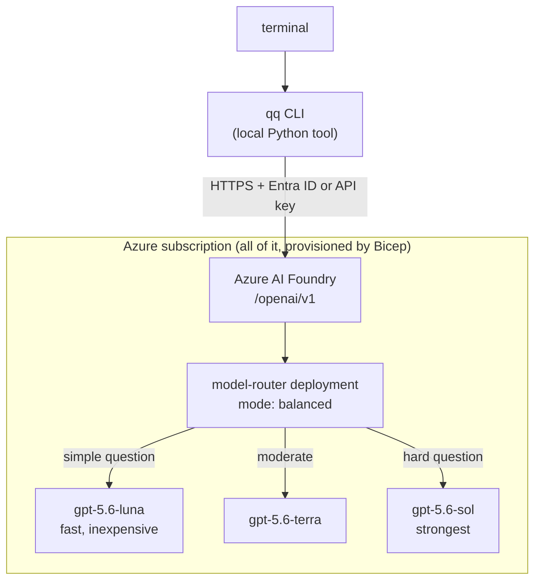

# qq

[](https://github.com/CrankingAI/qq-router/actions/workflows/ci.yml)
[](LICENSE)
[](https://www.python.org/downloads/)
[](https://learn.microsoft.com/azure/foundry/)
[](https://learn.microsoft.com/azure/foundry/openai/concepts/model-router)
[](https://github.com/astral-sh/ruff)

**Ask a quick question from your terminal. Get a short answer back.**

`qq` is for the questions that do not deserve a browser tab. Azure AI Foundry's
Model Router picks a cheap model for easy questions and a stronger one for hard
ones, so you do not have to think about which model to use.

```console
$ qq how do I list all my github repos
```
```bash
gh repo list --limit 1000
```
```console
$ qq --verbose what is a CNAME
A CNAME record aliases one DNS name to another...
[deployment=qq-router model=gpt-5.6-luna-2026-07-09 latency=1.97s tokens=196in/83out]
```

Answers go to stdout, diagnostics to stderr, so `qq` composes in a pipeline.

## Architecture

Deliberately tiny. There is no API, no gateway, no database, no Key Vault, and
no proxy. The CLI calls Azure directly.



The whole server side is one `Microsoft.CognitiveServices/accounts` resource of
kind `AIServices` plus one `model-router` deployment on it.

## Prerequisites

| Tool | Why | Install |
|---|---|---|
| Azure subscription | hosts the Foundry resource | — |
| [Azure CLI](https://learn.microsoft.com/cli/azure/install-azure-cli) 2.60+ | deploy and sign in | `brew install azure-cli` |
| [`jq`](https://jqlang.github.io/jq/) | the scripts parse JSON | `brew install jq` |
| [`uv`](https://docs.astral.sh/uv/) or [`pipx`](https://pipx.pypa.io/) | installs `qq` in its own environment | `brew install uv` |
| Python 3.11+ | provided by uv/pipx if you lack it | `brew install python` |

You need permission to create a resource group and a Cognitive Services account
in the target subscription. Granting yourself the inference role additionally
needs `Owner` or `User Access Administrator`; without it, pass `--no-grant` and
have someone assign the role for you.

## 1. Deploy Azure

```bash
git clone https://github.com/CrankingAI/qq-router.git
cd qq-router
az login
./scripts/deploy.sh
```

That provisions everything at subscription scope, creating the resource group as
it goes. Useful options:

```bash
./scripts/deploy.sh --dry-run                       # what-if, changes nothing
./scripts/deploy.sh --env prod --location swedencentral
./scripts/deploy.sh --routing-mode cost --capacity 30
./scripts/deploy.sh --subscription <id>             # default: current az subscription
./scripts/deploy.sh --help
```

Before deploying, the script checks that `model-router` and the three OpenAI
models exist in your chosen region and stops with a clear message if they do
not. Afterwards it verifies the router is pinned to OpenAI models only.

The deployment is idempotent: re-running converges the same resources.

### What gets created

| Resource | Purpose |
|---|---|
| `rg-qq-dev` | resource group |
| `qq-dev-<hash>` | Foundry account, `kind: AIServices`, SKU `S0` |
| `qq-router` | `model-router` deployment, `GlobalStandard`, capacity 10 |

### Parameters

Edit `infra/main.bicepparam.example`, copy it to `infra/main.bicepparam` (which
is gitignored), or pass `--parameters` yourself.

| Parameter | Default | Notes |
|---|---|---|
| `namePrefix` | `qq` | resource name prefix |
| `environment` | `dev` | name suffix and tag |
| `location` | `eastus2` | must support model-router |
| `routerDeploymentName` | `qq-router` | what `qq` sends as the model id |
| `routingMode` | `balanced` | `balanced`, `cost`, or `quality` |
| `routerModelVersion` | `2025-11-18` | Microsoft updates this version in place |
| `routerCapacity` | `10` | thousands of tokens per minute |
| `routerModels` | three `gpt-5.6-*` models | the routing subset |
| `principalId` | `''` | grants Foundry User; empty skips it |
| `logAnalyticsWorkspaceId` | `''` | enables diagnostics; empty skips it |
| `disableLocalAuth` | `false` | `true` refuses API keys entirely |

`routerModels` is parameterised so you can change the lineup without touching
the template. Supply at least two models: a single-model subset disables
automatic failover.

## 2. Install the CLI

```bash
./scripts/setup-cli.sh
```

This picks `uv` if you have it and `pipx` otherwise, installs `qq` into its own
isolated environment, discovers your endpoint from Azure, writes the config
file, and runs `qq doctor`. It does not touch your shell rc files unless you
pass `--update-shell`.

```bash
./scripts/setup-cli.sh --resource-group rg-qq-dev
./scripts/setup-cli.sh --use-api-key        # store a key instead of using Entra
./scripts/setup-cli.sh --tool pipx
./scripts/setup-cli.sh --help
```

Installing by hand instead:

```bash
uv tool install git+https://github.com/CrankingAI/qq-router
qq config set endpoint https://<your-resource>.openai.azure.com
qq config set deployment qq-router
qq config set tenant "$(az account show --query tenantId -o tsv)"
```

If `qq` is not found afterwards, `~/.local/bin` is not on your `PATH`. Add it,
or re-run with `--update-shell`.

## Authentication

`qq` supports both. Entra ID is the default and the better choice for anything
shared, because there is no secret to leak or rotate.

### Microsoft Entra ID (passwordless, recommended)

```bash
az login
qq config set auth entra
qq config set tenant "$(az account show --query tenantId -o tsv)"
```

`qq` asks `DefaultAzureCredential` for a token scoped to
`https://ai.azure.com/.default` and hands the SDK a token *provider*, so the
token refreshes per request rather than expiring mid-session. Tokens are cached
on disk with `0600` permissions until shortly before expiry, which saves about
0.65s per question; disable with `QQ_NO_TOKEN_CACHE=1`.

You need the **Foundry User** role on the Foundry account. `deploy.sh` grants it
to you automatically. To grant someone else:

```bash
az role assignment create \
  --role 53ca6127-db72-4b80-b1b0-d745d6d5456d \
  --assignee <object-id> \
  --scope "/subscriptions/<sub>/resourceGroups/rg-qq-dev/providers/Microsoft.CognitiveServices/accounts/<account>"
```

> **Setting `tenant` matters.** `DefaultAzureCredential` asks the Azure CLI for a
> token using the CLI's *current* subscription, which is global state any shell
> can change. If it points at another tenant you get
> `Tenant provided in token does not match resource token` despite being logged
> in. Pinning the tenant makes `qq` immune to that.

### API key

```bash
qq config set api_key '<key>'     # stored 0600, never printed
qq config set auth key
```

Or per-invocation, without persisting anything:

```bash
QQ_API_KEY=... qq what is a CNAME
```

Get a key with:

```bash
az cognitiveservices account keys list -g rg-qq-dev -n <account> --query key1 -o tsv
```

## Usage

```bash
qq how do I list all my github repos          # quoting optional
qq "explain EIP-3009 in two sentences"        # quoting fine too
qq --verbose what is a CNAME                  # diagnostics on stderr
qq --model gpt-5.6-sol explain TCP slow start # bypass the router
qq --version
qq --help
```

### Piping and stdin

stdin alone becomes the question:

```bash
echo "what is EIP-3009?" | qq
```

stdin plus a question sends the question first and the piped text as labelled
input:

```bash
git diff | qq summarize this
cat error.txt | qq explain this error
kubectl get pods | qq which of these look unhealthy
qq how do I list all my repos | pbcopy
```

Piped input is truncated to the last 100,000 characters, keeping the tail
because that is where errors are.

### Subcommands

```bash
qq doctor          # diagnose install, config, auth, and a live call
qq config show     # resolved settings and where each came from
qq config set KEY VALUE
qq config unset KEY
qq config path
```

`doctor` and `config` are only treated as subcommands when the rest of the line
looks like one. `qq doctor who wrote this` is a question. Force it with
`qq --ask doctor`.

## Configuration

Precedence, highest first: flags, `QQ_*` environment variables,
`AZURE_OPENAI_*` environment variables, the config file, built-in defaults.

| Variable | Config key | Default | Meaning |
|---|---|---|---|
| `QQ_ENDPOINT` | `endpoint` | — | Foundry endpoint; `/openai/v1` is appended for you |
| `QQ_DEPLOYMENT` | `deployment` | `qq-router` | router deployment name |
| `QQ_API_KEY` | `api_key` | — | API key; leave unset to use Entra ID |
| `QQ_AUTH` | `auth` | `auto` | `auto`, `entra`, or `key` |
| `QQ_TENANT_ID` | `tenant` | — | Entra tenant owning the resource |
| `QQ_MODEL` | `model` | — | address a deployment directly |
| `QQ_API` | `api` | `auto` | `auto`, `chat`, or `responses` |
| `QQ_TIMEOUT` | `timeout` | `60` | request timeout in seconds |
| `QQ_CONFIG_DIR` | — | OS default | override the config directory |
| `QQ_NO_STREAM` | — | — | disable streaming |
| `QQ_NO_TOKEN_CACHE` | — | — | disable the Entra token cache |
| `QQ_OTEL` | — | — | `1` enables OpenTelemetry tracing |

`AZURE_OPENAI_ENDPOINT` and `AZURE_OPENAI_API_KEY` are honoured as fallbacks so
an existing Azure setup works with no extra configuration.

The config file lives at `~/.config/qq/config.toml` on macOS and Linux
(`%APPDATA%\qq\config.toml` on Windows), mode `0600` in a `0700` directory.

### Which API surface

`qq` defaults to Chat Completions. That is not nostalgia: as of September 2026
the `model-router` model advertises only the `chatCompletion` capability in
every region, and calling `/openai/v1/responses` against a router deployment
returns `400 The requested operation is unsupported`. Direct model deployments
such as `gpt-5.6-luna` do support Responses, so `--api responses` is available
for those. Check for yourself:

```bash
az cognitiveservices model list --location eastus2 \
  --query "[?model.name=='model-router'].model.capabilities" -o json
```

Both surfaces report the model that actually served the request, which is what
`--verbose` prints. `qq` never guesses the routed model.

## Verbose output

```console
$ qq --verbose what is a CNAME
A CNAME record aliases one DNS name to another...
[deployment=qq-router model=gpt-5.6-luna-2026-07-09 latency=1.97s tokens=196in/83out]
```

`deployment` is what `qq` addressed, `model` is what the router actually chose.
This line always goes to stderr, so it never pollutes a pipeline:

```bash
qq --verbose ... 2>/dev/null   # answer only
qq --verbose ... >/dev/null    # diagnostics only
```

## Cost

The architecture has **no fixed cost**. Neither the `S0` Cognitive Services
account nor a `GlobalStandard` model deployment carries an hourly or
provisioning charge, so an idle `qq` costs nothing. Only fine-tuned model
deployments bill for hosting, and `qq` does not create one.

You pay per token: the model-router input meter plus the normal input/output
tokens of whichever model it selects. Typical terminal questions are a few
hundred tokens, so per-question cost is fractions of a cent. Piping a large diff
costs more; that is what the 100,000 character cap is for.

`routingMode` is the cost lever. `cost` biases toward cheaper models, `quality`
toward stronger ones, `balanced` sits between.

How much routing you actually observe depends on how far apart your subset is.
The default three `gpt-5.6-*` models are close in capability, and in testing
`balanced` selected `gpt-5.6-luna` for everything from `what does chmod 755
mean` to a proof of the halting problem. Add a genuinely cheaper model such as
`gpt-5.4-nano` to `routerModels` if you want the router to have somewhere
cheaper to go. `--verbose` always shows which model answered.

> **Third-party models are excluded on purpose.** The router's full candidate
> pool includes Anthropic, xAI, DeepSeek and Meta models, which bill separately
> rather than against Azure consumption. `infra/main.bicep` pins the subset to
> three OpenAI models, and `deploy.sh` fails the deployment if any non-OpenAI
> model or an empty subset is detected. Leaving `routerModels` empty would let
> the router reach third-party models, so do not do that casually.

Current rates: [Azure AI Foundry Models pricing](https://azure.microsoft.com/pricing/details/ai-foundry-models/).

## Observability

Client-side tracing is opt-in, since `qq` makes one call and should start fast:

```bash
uv tool install --with 'qq-cli[otel]' git+https://github.com/CrankingAI/qq-router
QQ_OTEL=1 OTEL_EXPORTER_OTLP_ENDPOINT=http://localhost:4318 qq what is a CNAME
```

Server-side needs no code. Point the Bicep at a Log Analytics workspace and
Azure records per-request latency, token counts, and the selected model:

```bash
./scripts/deploy.sh   # after setting logAnalyticsWorkspaceId in your bicepparam
```

It is off by default because a workspace is a billable resource.

## Fork and run your own

Nothing in this repo is specific to one Azure account.

1. Fork, then `git clone` your fork.
2. `az login` and select your subscription.
3. `./scripts/deploy.sh --name-prefix <yours>` — names include a hash of the
   resource group id, so they will not collide with anyone else's.
4. `./scripts/setup-cli.sh`
5. `qq doctor`

To change the model lineup, edit `routerModels` in
`infra/main.bicepparam.example` and redeploy. Routing changes take up to five
minutes to take effect.

## Uninstall

```bash
uv tool uninstall qq-cli          # or: pipx uninstall qq-cli
rm -rf ~/.config/qq               # config file and token cache
./scripts/teardown.sh --env dev   # delete the Azure resources
```

`teardown.sh` asks you to type the resource group name unless you pass `--yes`.
Add `--purge` to purge the soft-deleted Foundry account so the name is
immediately reusable.

## Security

Short version: the prompt is the only thing that leaves your machine, keys are
never printed, and Entra ID is the default. See [SECURITY.md](SECURITY.md).

One thing worth repeating: `qq` sends whatever you pipe into it. `git diff | qq`
sends your diff. Think before you pipe.

## Development

```bash
uv sync --all-extras
uv run pytest
uv run ruff check .
uv run ruff format .
az bicep build --file infra/main.bicep --stdout > /dev/null
shellcheck scripts/*.sh
```

CI runs the tests on Python 3.11 through 3.13, lints and format-checks with
Ruff, builds and lints the Bicep, ShellChecks the scripts, and scans for
secrets. **No Azure credentials are used in CI** — the Azure client is stubbed,
so a fork runs the full suite unchanged.

## License

[MIT](LICENSE)
